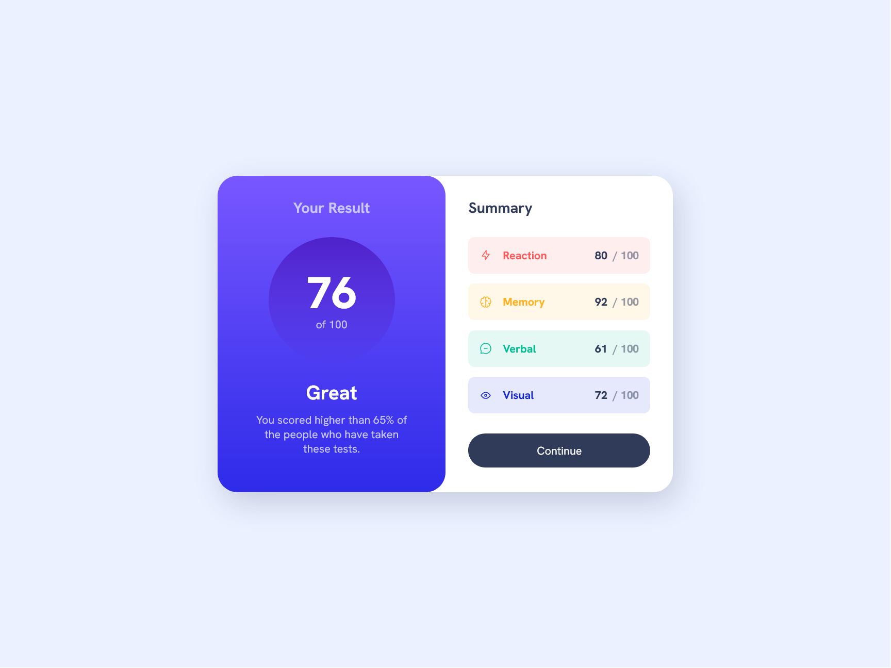

# Frontend Mentor - Results summary component solution

This is a solution to the [Results summary component challenge on Frontend Mentor](https://www.frontendmentor.io/challenges/results-summary-component-CE_K6s0maV). Frontend Mentor challenges help you improve your coding skills by building realistic projects.

## Overview

## Links

- Live preview [here](https://cat-script.github.io/results-summary-component)

## Acknowledgments

My solution is based on Kevin Powell's [video](https://www.youtube.com/watch?v=KqFAs5d3Yl8&list=PL4-IK0AVhVjPregcc6pgAIerVqSWaJEM4). I made some modifications, added `scripts.js` to fetch data from `data.json`.
